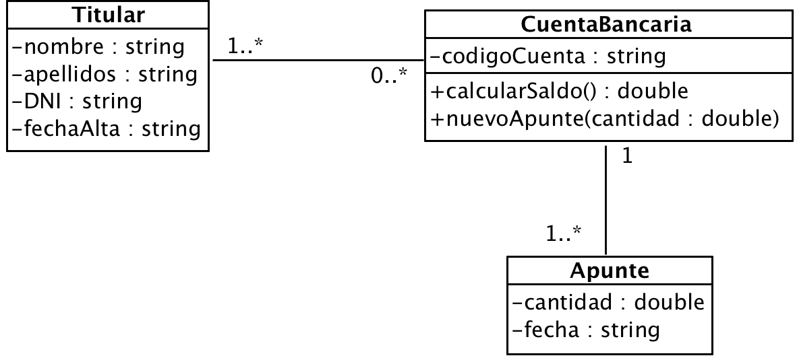

# Ejercicio 4 - Cuenta bancaria

Queremos construir una aplicación que nos permita gestionar información sobre cuentas bancarias, tal como aparecen en el siguiente diagrama de clases:

El programa mostrará un menú como el siguiente:

1. Titular
	1. Nuevo titular
2. Cuenta bancaria
	1. Nueva cuenta
	2. Nuevo apunte
	3. Borrar cuenta
3. Consultas
	1. Dado un titular, saldo de todas sus cuentas
	2. Dada una cuenta, titulares asociados
4. Salir

El programa principal pedirá al usuario todos los datos necesarios y creará los objetos necesarios.

> NOTA: El saldo de la cuenta no se almacena, se calcula cada vez que se llama a `calcularSaldo()`
