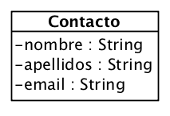

# Ejercicio 6 - Contactos de Whatsapp

Queremos construir una aplicación para mantener una agenda de contactos de Whatsapp. 

De un contacto mantenemos, además del número de teléfono, los datos que aparecen en la clase siguiente:

El programa mostrará un menú como el siguiente:

1. Gestión de contactos
	1. Nuevo contacto.
	2. Eliminar contacto.
2. Búsqueda
	1. Buscar contacto por número de teléfono.
	2. Buscar contacto por nombre.
3. Listados
	1. Listado de todos los contactos, tal como se han añadido.
	2. Listado de todos los contactos, ordenados por número de teléfono.
4. Salir

El funcionamiento del sistema es el siguiente:

- Para almacenar la información se recomienda usar el interfaz `Map<K,V>`, donde `K` sea el teléfono y `V` el contacto, aunque no tiene por qué ser la única estructura que usemos.
- No hay límite en el máximo de contactos que podemos almacenar en el sistema.
