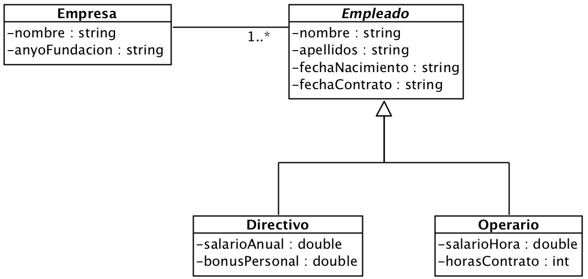

# Ejercicio 8 - Empresas y empleados (con herencia)

Queremos construir una aplicación que permita almacenar la información relevante sobre empresas y sus empleados, tal como aparecen en el siguiente diagrama de clases:

El programa mostrará un menú como el siguiente:

1. Empresa
	1. Crear nueva empresa
	2. Borrar una empresa
2. Añadir empleados (a una empresa)
	1. Añadir operario
	2. Añadir directivo
	3. Listar empleados (de la empresa)
3. Listados
	1. Todas las empresas
	2. Todos los empleados
	3. Listado por empresa y empleado
4. Salir

El programa principal pedirá al usuario todos los datos necesarios y creará los objetos necesarios.

> NOTA: No hay límite en el número de empresas ni de empleados.
